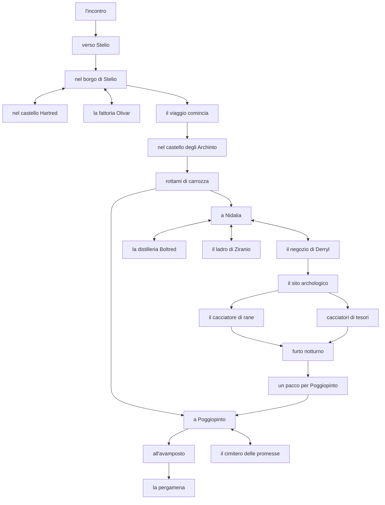
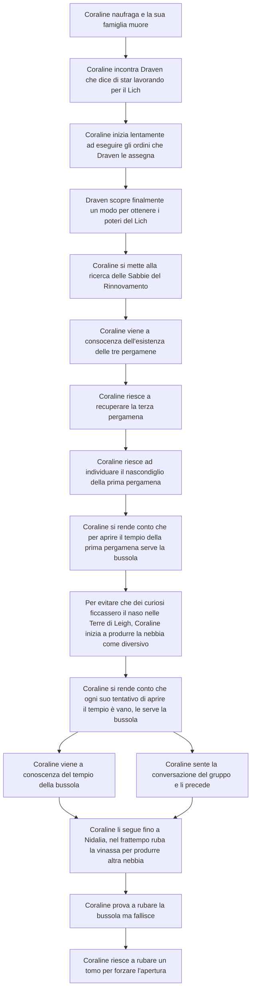

---
{"dg-publish":true,"permalink":"/gdr/gm/un-cimitero-per-le-promesse/un-cimitero-per-le-promesse-atto-i/atto-i/"}
---


> [!Quote]
> Nel cimitero delle promesse, dove anime tradite trovan dimora, si svela un racconto un tempo dimenticato. La storia rivela l'ambizione senza scrupoli di coloro che, pur di raggiungere i loro obiettivi, hanno tessuto una tela di promesse false, sfruttando i sentimenti altrui, ingannando cuori e vanificando sogni.
> Ma i cuori gentili, ignari di tali inganni, indossano le promesse come fossero una preziosa collana di perle, inconsapevoli del pericolo che si cela in esse. Ignorano che, prima o poi, quelle menzogne si stringeranno attorno al loro collo, soffocandoli senza pietà.

# Introduzione
La campagna inizia con l'introduzione ai giocatori del luogo in cui si trovano, specificando eventi importanti, giorno e anno in cui ci si trova e altre informazioni che possono risultare utili al momento.
Tutte le descrizioni presenti in questa sezione, devono fungere come spunto.

>[!story-telling] Descrizione
>Benvenuti sul pianeta di Fayi, un luogo tanto distante da noi quanto particolare ed unico.
>Oggi è l'ottavo giorno di Rustoria, tredicesimo mese dell'anno 1705. Il ché significa, che sono trascorsi 1705 anni dall'evento che sconvolse l'intero pianeta: la [[Cattura di Perdice\|Cattura di Perdice]]. 
>Con questo evento si intende il giorno a partire dal quale, la prima luna, chiamata [[Cleia\|Cleia]], fu affiancata da una seconda, soprannominata [[Perdice\|Perdice]]. A seguito di questo evento, il mondo venne rigirato come un calzino, causando vari squilibri naturali e guerre che finirono per cancellare gran parte della storia umana.
>Oggi però le cose sono diverse. Sono passati quasi 1000 anni dalla fine dell'[[Ultima Grande Guerra\|Ultima Grande Guerra]]. I paesi sopravvissuti, hanno cominciato la loro rinascita aprendo le loro frontiere. Mai come oggi, si respira un'aria di pace, che porta con sé ambizione e intraprendenza.




# Capitolo 1. L'incontro

>[!info]
>È normale che l'inizio della campagna sembri un po' più vincolato, questo perché occorre instradare tutti quanti i personaggi. Presumibilmente questa cosa sarà meno evidente più avanti.

Il gruppo comincia la loro avventura insieme all'interno della foresta del [[GDR/GM/Fayi/Luoghi/Sacro Regno di Uulaan\|Sacro Regno di Uulaan]], precisamente al confine con il [[GDR/GM/Fayi/Luoghi/Regno di Atro\|Regno di Atro]]. Per un motivo o per un'altro, tutti quanti i personaggi sono interessati a saperne di più sulle voci che hanno cominciato ad emergere circa un artefatto, chiamato [[GDR/GM/Fayi/Altro/Sabbie del Rinnovamento\|Sabbie del Rinnovamento]] e per questo hanno intrapreso un viaggio.
Questo pellegrinaggio, che ha come meta finale il piccolo villaggio di [[GDR/GM/Fayi/Luoghi/Stelio\|Stelio]], si interrompe col giungere della notte nei pressi di alcune rovine di una antica chiesa nel mezzo della giunga.

````col
```col-md
flexGrow=0.4
===
 
```

```col-md
flexGrow=1
===
>[!story-telling] Descrizione
>Arrivi nei pressi di alcune rovine, che al primo sguardo sembrerebbero essere quelle di una anticha chiesa. La struttura è fatta di pietra grigia ed è ricoperta da piante rampicanti e liane.

```
````

Importante far notare che di fronte alle rovine sembrerebbero essere stati messi dei tronchi tutti intorno a quelli che sembrano decisamente dei resti di un falò.

Lentamente uno dopo l'altro, fanno la loro comparsa i vari personaggi. Il primo ad arrivare è Brandon, seguito da Elea ed infine da Icab, che arriva magari al termine del tramonto. 
Da questo momento in poi il party ha la possibilità di interagire fra loro e magari anche esplorare i dintorni delle rovine. 
Se decidono di far ciò, noteranno che gli interni sono mal messi, e il tetto è pericolante in alcuni punti. Qualsiasi altare o statua all'interno della chiesa, sono stati ormai rimossi da tempo, però comunque i personaggi avranno l'occasione di fare domande nel caso volessero ricevere approfondimenti.

Nel momento in cui loro si accamperanno per passare la notte, verranno risvegliati da un suono alquanto strano. Alcuni colpi sordi, seguiti da una voce che chiede aiuto. Non si capisce bene da quale parte stia provenendo il suono, ma questo è continuo e non si ferma. È come se qualcosa si stesse dimenando. 
Dopo aver seguito il suono, ci si renderà conto che questo proviene dall'antico cimitero che fiancheggia le rovine, precisamente da una tomba la cui terra sembra sia stata smossa da poco.
Dopo aver scavato per pochi metri, si accorgeranno che quel suono proviene da Arièl, che era stato seppellito vivo per qualche strana ragione, ma che è stato salvato per puro caso.

Qui ci sarà altro tempo per loro di fare domande e interagire fra di loro. 

# Capitolo 2. Verso Stelio

La mattina seguente il party dovrà imboccare nuovamente il sentiero verso il piccolo borgo di Stelio. E così fanno, attraversando la [[Foresta Sbuffante]].

>[!story-telling] Descrizione
>Precisare che il sentiero che conduce al confine del Sacro Regno, passa vicino al fiume [[Udrel]]. 

In questo pezzo di sentiero, non occorre fare il tiro di viaggio. Dopo dopo una quarantina di minuti, che il party ha cominciato a camminare, arriva nella zona della palude nella quale il sentiero si interrompe a causa della presenza dell'acquitrino.

````col
```col-md
flexGrow=0.4
===
![[pontile_nella_palude.jpeg | 250]]
```

```col-md
flexGrow=1
===
>[!story-telling] Descrizione
>E così, dopo quasi un'ora di camminata giungete sulla sponda di un acquitrino. Il sentiero in questa zona sembra essere abbastanza battuto, e non ci mettete troppo a notare lo stretto pontile che si estende per diversi metri sullo specchio d'acqua paludoso. Qui, l'odore acre della palude si fa più forte e percepite che l'umidità è salita parecchio. Inoltre, sentite che i rumori del bosco sono stati coperti dai ronzii prodotti dalle migliaia di insetti che fanno la spola in questa zona. 
```
````

Proseguendo cautamente sul pontile per una trentina di metri, il gruppo arriverà a quello che appare loro come un casotto. E davanti a questo casotto, illuminato dalla luce di una lanterna, vi è una piccola imbarcazione di legno che galleggia sull'acqua melmosa.
Quando si avvicineranno al casotto, faranno la conoscenza di un individuo molto particolare. Il suo nome è [[Gulbert il traghettatore | Gulbert]] e di mestiere fa il traghettatore. Se interpellato, si rivolgerà a loro con fare particolare. 
Gulbert gestisce l'attraversamento della palude con la sua piccola imbarcazione, con la quale porta i viaggiatori da una parte all'altra in comodità. Ovviamente, con il fatto che non ha altra concorrenza, in quanto nessun'altro si azzarderebbe a stare tutto il giorno in un posto del genere, fa pagare i suoi servizi molto più del dovuto. Si parla di 40 zirconi a persona per la traversata, quando un servizio del genere, ne costerebbe solamente 20.

Ci sono un sacco di cose che il party può decidere di fare in questa occasione, provare a corrompere l'uomo con altri beni, provare a spaventarlo, contrattare il prezzo, pagare direttamente la cifra, etc. 
Esiste però una seconda opzione. 

La signora [[Cornelia la sarta | Cornelia]], che in quel momento stava effettuando il suo viaggio di ritorno dalla capitale del Sacro Regno, nella quale si era recata per comperare alcune stoffe per il suo negozio. Il gruppo la incontra nel mentre che stanno aspettando sul pontile quando vedono che il carretto che lei sta trasportando si è palesemente incastrato tra alcune assi della passerella che si sono rotte al passaggio della ruota.
Se il party deciderà di aiutarla, lei inviterà tutti a salire sulla sua chiatta di legno che tiene nascosta sotto un mucchio di liane pochi metri più avanti sulle sponde di una isoletta che emerge dalla palude.

Da questo punto in poi, a seconda dalla strada intrapresa dal gruppo, che non escludo si possa dividere, gli scenari possibili diventano due.

## Opzione A. Sulla chiatta di Cornelia
La chiatta di Cornelia è una piccola imbarcazione simile ad una zattera, anche se sono presenti alcuni punti in cui è possibile mettersi a sedere. Non vi è nessun timone e neanche una vela, in quanto la chiatta si muove spingendo sul fondale con un lungo bastone di legno. 

Da questo momento verrà effettuato il tiro di viaggio che ha come taglia un d10. 
- Scoperta: durante la traversata della palude il gruppo incontra magari un piccolo campo di fiori selvatici rari che possono essere rivenduti ad alto prezzo oppure, un qualche oggetto come ad esempio una vecchia spada conficcata nel terreno.
- Tranquillo: il viaggio scorre tranquillo, senza ulteriori intoppi.
- Pericolo: se nell'avvicinarsi all'arma che sbuca dall'acqua, qualcuno prova a prenderla, noterà che questa era in realtà conficcata nella coda di uno strano coccodrillo, che viene risvegliato dal dolore ed arrabbiato comincia una fight.


## Opzione B. Navigando con Gulbert
La barca di Gulbert invece è leggermente messa meglio, anche se si vede da lontano un chilometro che è parecchio vecchia. A differenze della chiatta di Cornelia, la barca di Gulbert è dotata di due grandi remi che spingono via le alghe e possono essere usati per smuoversi dal fondo sabbioso.

- Scoperta: durante la traversata della palude il gruppo assiste ad una scena fantastica, come ad esempio potrebbe essere la migrazione di una specie di pesci luminosi, oppure il passaggio di qualche piccola creatura volante.
- Tranquillo: il viaggio scorre tranquillo, senza ulteriori intoppi.
- Pericolo: durante il viaggio il party si avvicina pericolosamente ad una creatura che se spaventata reagirà bruscamente innescando una fight.

Entrambe le parti si imbatteranno, anche se in maniera differente, nelle [[Rovine di Elduruth]], all'interno delle quali rimarranno intrappolati e dovranno trovare un modo per proseguire oltre.
Nel bel mezzo delle rovine, il gruppo verrà diviso in questo modo: Elea ed Arièl da una parte e Cornelia (o Gulbert), Icab e Brandon dall'altra.

---

Finita la traversata, sperando che il gruppo sia sopravvissuto, dopo un paio di ore di camminata la foresta scompare lentamente, lasciando spazio prima ad una radura che poi si estende sempre di più fino a scomparire del tutto. Questo segna il confine con il Sacro Regno, e l'inizio del Regno di Atro.
Se il percorso è stato fatto assieme a Cornelia, questa li saluterà ad un bivio con dei cartelli, indicando al gruppo la strada da seguire per raggiungere il piccolo borgo di Stelio.

>[!story-telling] Descrizione
>Arrivate dunque, dopo un paio d'ore di camminata ad un bivio segnalato da alcuni cartelli, scritti con dei segni che, eccetto Icab, nessuno riconosce. È la lingua del Regno di Atro, che rimarca ancora di più il fatto che avete ormai oltrepassato da molto il confine. Non occorre però che nessuno si sforzi a leggere i cartelli, in quanto Cornelia pone fine a tutti i vostri dubbi indicandovi la via.
>
>"Per raggiungere il Stelio proseguite su questo sentiero, passate oltre il fiume e in fine sulla destra, in cima ad un piccolo colle scorgerete il borgo. Io invece proseguirò in quest'altra direzione, verso [[Nidalia]], è stato un piacere conoscervi!"
\- Cornelia

# Capitolo 3. Nel Borgo di Stelio

Il gruppo arriverà al [[Stelio|borgo]] verso sera, per questo dovranno aspettare almeno fino alla mattina seguente per poter incontrare, [[Ertrev Hartred]], il nobile della città.


<div class="transclusion internal-embed is-loaded"><div class="markdown-embed">


## Mappa:

```leaflet
id: H5T9G2G
image: [[borgo_di_Stelio.svg]]
height: 700px
lat: 50
long: 50
minZoom: 1
maxZoom: 10
defaultZoom: 8.4
zoomDelta: 0.3
unit: meters
scale: 1
noUI: false
darkMode: false
```


</div></div>


Nel frattempo però avranno tutto quanto il tempo di esplorare il borgo e le sue caratteristiche.

All'interno del borgo è presente anche l'ufficio postale che però chiude al calare del sole.
La mattina seguente il gruppo di avventurieri avrà altro tempo per organizzarsi e magari esplorare i negozi. 

## Tappa 1: Nel castello degli Hartred
Una delle tappe necessarie è all'interno del castello del signore del borgo, Ertrev Hartred. Non è detto che tutti si dirigeranno insieme qui.
Quando entreranno all'interno del castello, sorvegliato da un paio di guardie, verranno accolti da [[Caspivald il maggiordomo | Caspivald]], il maggiordomo del signor Hartred che si troverà nel salone principale.

>[!story-telling] Descrizione
>"Salve signori, il mio nome è Caspivald e sono il maggiordomo del signor Ertrev Hartred, avevate un appuntamento per una udienza per caso? "
\- Caspivald

Dopo aver assicurato loro l'entrata il gruppo si dirigerà verso la sala in cui si trova Ertrev che in quel momento stava sistemando alcune questioni burocratiche legate al suo piccolo borgo.
La conversazione non sarà troppo lunga, ma è importante che Ertrev si mostri abbastanza sorpreso che qualcuno abbia effettivamente fatto un viaggio così lungo per accettare la sua richiesta.

>[!story-telling] Descrizione
>"La ricompensa per chiunque riuscirà a portarmi quell'artefatto è di 700.000 zirconi"
\- Ertrev Hartred

Purtroppo Ertrev non sa indicare molto sull'artefatto, dicendo che tutto quello che sa proviene da dicerie, indica però che sono giunte voci su un misterioso tempio nelle vicinanze del borgo di [[Nidalia]], all'interno del qualche è stata ritrovata una incisione che sembrerebbe far riferimento alle Sabbie. Dice che è un artefatto estremamente raro e potente. Magari racconta qualche leggenda sul suo potere. Dice che è in grado di controllare il tempo.

## Tappa 2: Nella fattoria del signor Olivar

Se usciti dal castello il gruppo comincerà a discutere apertamente della loro missione, ad esempio in locanda, la loro conversazione verrà ascoltata accidentalmente anche da [[Marilla Olivar | Marilla]]. Che dirà al gruppo che lei può dare loro una mano, non personalmente, ma accompagnandoli alla [[Fattoria Olivar |casa di suo nonno]], dal momento che lui conosce tantissime leggende.

Anche [[Coraline Inket |Coraline]], l'antagonista, però si trova lì in quel momento e sente anche lei la proposta di Marilla.

Se il gruppo ha questa conversazione dopo la metà giornata, Marilla proporrà di partire il giorno dopo presto, spiegando che partendo adesso si rischierebbe di arrivare troppo tardi disturbando il nonno e quindi darà appuntamento al gruppo nelle vicinanze della "porta-nuova", ovvero l'uscita nord del borgo al sorgere del sole.

### Opzione A: Partiamo subito!
 Il gruppo può insistere a partire subito provando a persuadere Marilla. Lei ovviamente non opporrà molta resistenza e partiranno immediatamente.
 In questo caso Coraline non riuscirà ad arrivare alla fattoria del nonno prima di loro e rubare così la pagina del libro nel quale sono contenute le informazioni che il gruppo stava cercando.

Il gruppo quindi si avvia verso la fattoria ed arriva verso il tramonto.

````col
```col-md
flexGrow=0.4
===
 
```

```col-md
flexGrow=1
===

>[!story-telling] Descrizione
>E così, dopo una lunga giornata di cammino, svoltato attorno all'ultimo colle, arrivate finalmente alla fattoria del nonno di Marilla. Vedete chiaramente un piccolo mulino ad acqua alimentato da un ruscello che scorre fra i campi e diversi animali che pascolano tranquillamente nella zona.
>La fattoria è delimitata da un muretto di pietra e al centro del terreno vi è una piccola abitazione di legno a due piani circondata da diversi alberi di betulla.

```
````
Marilla è molto contenta di poter far visita al nonno, apre il cancelletto e si dirige verso la casa. Marilla non fa neanche in tempo a bussare che la porta si spalanca e un signore le salta addosso abbracciandola forte.
Il nonno è una persona gentile e dopo essersi stupito che la nipote abbia portato a casa così tante persone, invita tutti ad entrare e a rimanere per la cena che stava preparando. 

Durante la loro permanenza alla casa del nonno, i personaggi avranno modo di fare domande e interagire con l'ambiente. 

Quando chiederanno maggiori informazioni sull'artefatto il nonno si mostrerà abbastanza stupito di tale domanda e soprattutto che persone come loro conoscono tali fatti. Ma comunque si mostrerà abbastanza propenso ad aiutare, dirigendosi alla libreria ed afferrando un antico libro di leggende.
Aperto il libro i giocatori verranno ricompensati con le seguenti informazioni:

>[!story-telling] La pagina del libro
>Raccontasi che secoli orsono, dalle mani di abili maghi,
sorse un artefatto noto come Sabbie del Rinnovamento.
Un clessidra misteriosa e possente, capace di mescolare il tempo.
Dar giovinezza a vecchiaia, e viceversa,
trasmutare qualsivoglia cosa o individuo.
Per scopi benevoli fu inizialmente adoperato,
ma poi cadde in disgrazia, e col tempo fu odiato.
Dichiarato maledetto, alla segretezza fu condannato,
e nell'oblio fu dimenticato.
Tuttavia, tre pergamene pervivono, che il suo nascondiglio rivelano,
ma nessuno conosce il loro preciso riparo.

Prima di lasciare la casa del nonno di Marilla, quest'ultima regalerà loro due pozioni di cura e un tonico. 

### Opzione B: Aspettiamo domani
Il gruppo accetta la proposta di Marilla e decide di partire il giorno dopo. In questo caso Coraline sarà in grado di partire immediatamente, riuscendo così ad intrufolarsi nella casa del nonno di Marilla durante la notte e strappare la pagina di un libro di leggende che riguarda le Sabbie del Rinnovamento.

Una volta che il gruppo si presenterà all'alba alla porta nuova, troverà Marilla che li sta aspettando e partiranno per il viaggio.
Tutto rimane invariato rispetto alla [[#Opzione A Partiamo subito! |Opzione A]], sennonché quando il gruppo arriva alla casa del nonno verso l'ora di pranzo, troverà il nonno che si sta adoperando a sistemare alcune casse che durante la notte Coraline ha fatto cadere, ma il nonno penserà che sia stato qualche animale.

Quando chiederanno della leggenda il nonno si dirigerà alla libreria e ci rimarrà di sasso quando noterà che esattamente quella pagina è stata strappata.

>[!story-telling] Descrizione
>"Mi dispiace di non potervi essere d'aiuto, se posso però consolarvi conosco una persona. Il suo nome è [[Kolt Ipper]] e lo troverete quasi sicuramente a [[Poggiopinto]]. Ho lavorato per tanti anni nel suo laboratorio e se c'è qualcuno che può aiutarvi in questo campo è proprio lui."
\- Signor Olivar

Prima di lasciare la casa del nonno di Marilla, quest'ultima regalerà loro una pozione di cura e un tonico. Inoltre per scusarsi del viaggio a vuoto Marilla regalerà loro un oggetto che potrebbe essere loro utile durante il viaggio.

---

A finita questa parte il gruppo ha la possibilità di decidere se andare verso Poggiopinto (linea A) oppure se andare verso Nidalia (linea B). 

# Capitolo 4. Il viaggio comincia

Entrambi i viaggi, sia che il gruppo decida di dirigersi a Poggiopinto che a Nidalia impiegano circa 3 giorni a piedi. Altrimenti 2 con un mezzo di terra.
Alla sinistra del gruppo noteranno svettare le rovine di un'antico castello, quindi presumibilmente si dirigeranno lì per trovare riparo.

>[!story-telling] Descrizione
>Improvvisamente, dal nulla sentite provenire un suono in lontananza seguito da un vento sempre più forte. Non capite immediatamente di che cosa si tratta. È un suono basso e profondo, che fa tremare la terra. Vi voltate e vi accorgete che un forte temporale sembra starsi dirigendo nella vostra direzione. 
>Sapete che non passerà troppo tempo prima che questo vi raggiunga, sarebbe meglio cercare riparo.


Se invece decideranno di proseguire oltre, dovrò far tirare loro un tiro sulla resistenza e altrimenti infliggere a tutto il gruppo uno status come conseguenza della pioggia e del freddo.

## Tappa 1: Le rovine del Castello Archinto

Il gruppo ha la possibilità di trovare riparo all'interno delle rovine di un castello dalla natura a loro sconosciuta. 

````col
```col-md
flexGrow=0.4
===
 
```

```col-md
flexGrow=1
===

>[!story-telling] Descrizione
>Così, correndo sotto la pioggia battente, arrivate alle rovine del castello che avevate precedentemente osservato da lontano. Si tratta di un castello, circondato da vecchie mura oramai completamente abbattute sulle quale la natura ha preso il sopravvento. Scorgete diversi betulle crescere fra i mattoni e non ci mettete tanto ad individuare l'ingresso. 
>Ad attendervi vi è una enorme portone di legno borchiato mezzo ammuffito semiaperto.

```
````

All'interno del castello si ritroveranno all'asciutto. Sembrerebbe che altre persone abbiano già pernottato qui, in quanto sono presenti delle tracce di un falò al centro della sala centrale. 

> [!info]
> leggere [[Castello Archinto | questa pagina]] per ulteriori informazioni sul castello

Nella stanza in fondo al corridoio del secondo piano vi è uno specchio rotto. Icab percepirà il fatto che quello specchio emana essenze di magia. Infatti, se ci si passa davanti, questo comincerà a proiettare delle immagini al posto del riflesso.

>[!story-telling]- Scena del Master - Lo Specchio di Larissa
>[[#Lo specchio di Larissa | Contenuto]]

Valutare la possibilità di inserire una fight nel seminterrato e dei tesori sparsi per il castello.

Terminata la quest del castello e la pioggia, il gruppo può riprendere il sentiero. Dopo aver camminato per un po' il gruppo raggiungerà un bivio dove dovrà decidere se dirigersi verso Poggiopinto oppure Nidalia.

È possibile utilizzare le seguenti opzioni durante il viaggio per renderlo più interessante.

## Quattro opzioni per il viaggio

Dal momento che i giocatori hanno la libertà di scegliere se andare prima a Poggiopinto oppure a Nidalia, è opportuno inserire a piacimento una di queste opzioni circa ogni giornata di viaggio.

### Opzione 1: Il cacciatore di rane

#### Capitolo 1: Xasper

Al tramonto il gruppo incontra [[Xasper]], il "*cacciatore di rane*": un personaggio bizzarro e misterioso che viaggia per le lande trasportando il suo carretto pieno di spiriti in bottiglia e altri prodotti mostruosi.

Xasper chiederà al gruppo se per caso desiderano comprare alcuni dei suoi prodotti. 

#### Capitolo 2: Il pozzo

Il gruppo decide di accamparsi in una zona nei limiti di un bosco. Durante la notte, tutti quanti cominciano a fare lo stesso sogno, non riuscendo, neanche provandoci, a svegliarsi. 

>[!story-telling] Descrizione
>Il vostro corpo non esiste più. Siete diventati una presenza, due occhi che si muovono fluttuando per il bosco. 
Questi due occhi scansano un albero dopo l'altro, ad una velocità strabiliante e si dirigono verso il cuore della foresta. Si sente il vento muoversi e i suoni della vita notturna ovattarsi.
Improvvisamente gli occhi arrivano in una piccola radura e al centro di questa vi è un vecchio pozzo di mattoni avvolto dalle edere. Si sente il rumore di qualcosa di metallico che viene lanciato in aria, e il tintinnio che fa mentre viene gettato nelle profondità del buco, mentre gli occhi lo seguono arrivando a toccare l'acqua.
In quel momento si sente una voce Vieni-vieni-vi...e..niii...
Poi, vi svegliate tutti quanti di colpo.

Il gruppo è stato chiamato da uno degli [[Spiritismo Eleriano#Spiriti dei pozzi | spiriti dei pozzi]], antiche creature delle quali ormai ci si è dimenticati l'esistenza. In cambio di una moneta lo spirito potrà esaudirà un loro desiderio. 

Quando il gruppo si sveglia si ritroverà circondato da tanti piccoli funghi, alcuni di essi luminosi, che poi si allungano verso il bosco, dove noteranno un sentiero fatto dei medesimi funghi che li conducono verso il pozzo.

### Opzione 2: Furto notturno

Coraline prova a rubare la bussola che il party è riuscito a reperire in seguito al dungeon,

### Opzione 3: I cacciatori di tesori

Incontro serale con una carovana di cacciatori di tesori. Qui incontreranno Brith, la sorella di Karola, riconoscibile per la collana che rappresenta [[Perdice]], mentre sua sorella aveva quella di [[Cleia]].

### Opzione 4: Rottami di una carrozza

Il gruppo ritrova, mezzi sotterrati, i resti di un antico carro. Il party ha la possibilità di prenderlo e portarlo con sé.


# Capitolo 5. A Nidalia

Il gruppo è libero sia di accedere al piccolo borgo di [[Nidalia]], sia che cercare direttamente nei dintorni il sito archeologico dal quale derivano le voci sulle Sabbie del Rinnovamento.


<div class="transclusion internal-embed is-loaded"><div class="markdown-embed">


## Mappa:
```leaflet
id: BRGNI1
image: [[borgo_di_Nidalia.svg]]
height: 700px
width: 100%
lat: 50
long: 50
minZoom: 1
maxZoom: 10
defaultZoom: 8.4
zoomDelta: 0.3
unit: meters
scale: 1
noUI: false
darkMode: false
```


</div></div>


Se entreranno prima al borgo avranno la possibilità di esplorarlo e parlare con gli abitanti, fare acquisti e dormire in una locanda. 
Per accedere al sito archeologico dovranno chiedere aiuto a [[Derryl, l'archeologo |Derryl]], l'archeologo che ha per primo ritrovato il tempio e che gestisce un piccolo [[L'Archifanto|laboratorio e negozio]] di pietre e reperti archeologici in città.

Inoltre il giorno in cui arriveranno a Nidalia, ci sarà il [[Nidalia#Mercato serale | mercato serale]], quindi il gruppo avrà l'occasione di vivere una piccola esperienza all'interno della città, assaggiando anche piatti tipici magari.

A giro per la città sarà possibile sentire gente che si lamenta di un carico importante proveniente dalla distilleria poco fuori città che è stato rubato. 
È possibile che si imbattano in un giornale, o magari qualche cartello che segnala il fatto che nelle [[Terre di Leigh]] sia ormai comparsa da qualche giorno una fitta nebbia che impedisce di accedere al bosco e che i soldati mandare a controllare ne siano usciti terrorizzati, incapaci di parlare e spiegare ciò che hanno visto al suo interno.

## Opzione 1: La consegna di Nikölas
>[!infobox]
>![[casa_di_nikölas.jpeg | 300]]

Si potranno recare allo studio di Nikölas per chiedere di che cosa ha bisogno. In generale la casa di Nikölas si presenta come uno studio e magazzino. Si trova al secondo piano di una casetta gialla di fianco ad una torre. 
Nikölas come lavoro fa il commerciante, specialmente di semi. 
Può volendo raccontare la sua storia e la storia della sua malattia della pelle, dicendo che l'ha contratta in seguito ad un carico contaminato proveniente dalla Rete molti anni prima. Inoltre al commerciante è vietato utilizzare il servizio postale dal momento che un anno prima un pacchetto che aveva spedito a [[Rue]] è saltato per aria facendo perdere due dita al postino. Da quel giorno la CLS ha gli ha vietato di utilizzare il servizio.

## Opzione 2: Ladro di Ziranio
Una volta che il gruppo si sarà avviato verso il [[Mulino di Eloise]]. Qui incontreranno [[Eloise la mugnaia| Eloise]] che spiegherà loro la situazione. 
In pratica sembrerebbe esserci un ladro che continua a rubare le riserve di farina di Ziranio appena macinate. Sembrerebbe riuscire ad entrare all'interno del fienile e a rubare i sacchi. Lascia inoltre diverse scie di Ziranio calpestato nei campi. Sta causando molti problemi sia al mulino di Eloise che alla comunità di contadini che abitano la zona. 

Questo capitolo si conclude con la cattura di Fergooson, l'oca fuggita tre giorni prima dalla fattoria del nonno di Marilla. Una volta aver consumato lo Ziranio, Fergooson diventa completamente pazzo e si precipiterà verso Nidalia, potendo potenzialmente seminare il panico tra i cittadini. Il gruppo deve riuscire a fermarlo prima che ciò accada.

## Tappa 1: Il negozio di Derryl
Il gruppo potrà entrare all'interno del negozio di Derryl.

````col
```col-md
flexGrow=0.6
===
![[il_lichene.jpeg | 350]] 
```

```col-md
flexGrow=1
===

>[!story-telling] Descrizione
>Appena entrate, notate subito che tutte le pareti interne sono completamente ricoperte da piante rampicanti e che alle pareti sono organizzate diverse ceste contenti ogni tipo di pietre e minerali che emettono fasci di luce iridescenti. 
>Alle pareti sono attaccati diversi fossili di animali a voi sconosciuti e dal soffitto pende un'intero scheletro di un animale che sembrerebbe ricordarvi una viverna. Ad un angolo vedete un un piccolo grammofono che suona una canzone.

```
````
Derryl in questo momento si trova in una stanza comunicante con il negozio nella quale stava analizzando alcune pietre. Quando sente gli avventurieri si dirigerà all'interno del negozio.

>[!story-telling] Descrizione
>"Oh, quanta gente! Salve avventurieri, il mio nome è Derryl. Come posso aiutarvi?"
\- Derryl

A questo punto il gruppo potrà chiedere a Derryl maggiori informazioni sul sito archeologico che stanno cercando. Le informazioni di cui lui è a conoscenza sono le seguenti:
- "Sono stato io a trovare il sito. Ho seguito una pista ottenuta decifrando un antico manoscritto e poi mi sono fatto trasportare dal mio sesto senso. Sapevo che avrei trovato qualcosa lì". Questa in realtà è una bugia. È vero che è stato Derryl a trovare il tempio abbandonato, ma lo ha fatto per caso, cadendo in mezzo a dei rovi. 
- "Al momento l'accesso al tempio è vietato agli avventurieri come voi, per questioni di sicurezza. Ma si dà il caso che io abbia una autorizzazione speciale". Anche questa è una bugia in quanto per ordine della famiglia [[Roswerd]], nessuno può accedervi senza la loro autorizzazione.
- "All'interno del tempio vi è solamente una grande lapide con delle scritture in due lingue differenti. La prima è Atriano antico e l'altra parte, quella più grande è scritta in con dei simboli che non avevo mai visto prima d'allora. Sono riuscito a decifrare la scritta, ma non il resto". Anche questa è una bugia, in quanto la parte in Atriano antico non è stata decifrata da Derryl ma bensì da [[Persival]], che è anche il proprietario del negozio. 
- "Il sito archeologico si trova non troppo lontano da qui, si tratta di circa un'ora in carrozza."
- "Nell'ultimo mese già altre persone mi hanno chiesto di vedere il sito archeologico. L'ultima è stata una ragazza vestita in modo molto strano". La ragazza di cui parla in questo caso è Coraline, che è anche lei in cerca dell'artefatto.

Magari Derryl dirà agli altri fra quanto potranno venire al negozio, considerando che devono aspettare che questo chiuda per la giornata. E in seguito li farà montare tutti quanti sulla sua carrozza, trainata da due coleotteri.
## Tappa 2: La Distilleria Boltred

La [[Distilleria Boltred]] è un centro di produzione di alcolici vari stra i quali l'[[Acquatulla]] e il [[Melingo]] che si trova poco distante dal centro abitato, ad appena 30 minuti a piedi.
Molte delle persone di Nidalia lavorano in quella distilleria ed è quindi molto probabile che in giro si sia diffusa la notizia di un importante carico di [[vinassa]] rubato. 

Coraline ha acquisito il carico necessario per creare un potente inganno nella foresta: una densa nebbia illusoria. Quest'illusione ha un effetto destabilizzante sulle persone che la respirano, portandole all'insania. Questo stratagemma serve a tenere lontani tutti quanti, al fine di permettere a Coraline di recuperare la preziosa pergamena.

Il gruppo può decidere di recarsi alla distilleria per porre alcune domande all'amministratore oppure al sopravvissuto dell'attacco. La distilleria è chiusa di sestodì.

# Capitolo 6. Il sito

[[Sito Archeologico di Nidalia]] è attualmente in controllo della famiglia Roswerd ed è organizzato con la massima serietà. Per avere maggiori informazioni sull'organizzazione logistica del Sito Archeologico clicca [[Sito Archeologico di Nidalia | qui]].

L'obbiettivo del gruppo arrivati a questo punto sarà quello di:
- Capire come è organizzato il sito
- Intrufolarsi al suo interno (ci sono vari modi)
- Capire come entrare all'interno dell'anticamera del tempio
- Capire come effettuare il rituale ed accedere all'interno del tempio vero e proprio

Una volta entrati si ritroveranno all'interno del [[Tempio della Bussola]]. Una volta che la porta sarà stata sbloccata la narrazione si fermerà in favore di una scena del master 
>[!story-telling]- Scena del Master
>[[#3.1. L'Incarico di Kondat]]

# Capitolo 7. A Poggiopinto

Il borgo di [[Poggiopinto]], come si può osservare dalla mappa qui sotto, è costituito da un'ampia zona residenziale esterna e da una cittadella fortificata interna. In questo luogo, chiamato il Nocciolo, si concentrano i punti focali della città. Per questa ragione, in seguito ai frequenti furti che si sono verificati, il signore della città ha ordinato di controllare tutti quanti gli accessi, e di vietare l'ingresso alle persone sospette.

Se il gruppo vorrà entrare all [[Reliquiario di Isadoria]], dove poter parlare con [[Kolt Ipper]] e ottenere maggiori informazioni sulle Sabbie del Rinnovamento, deve passare attraverso un posto di blocco e far controllare tutti quanti gli oggetti che trasportano. Il posto di blocco è stato organizzato per cercare di prevenire i vari furti che stanno scuotendo il Regno di Atro.  

Al [[Centro Commerciale di Poggiopinto]] troveranno nella piazza centrale una bancarella con Xasper. Xasper percepirà l'odore di Mr. Beckenbruineneim. 


<div class="transclusion internal-embed is-loaded"><div class="markdown-embed">


## Mappa:
```leaflet
id: BRPP01
image: [[borgo_di_Poggiopinto.svg]]
height: 700px
width: 100%
lat: 50
long: 50
minZoom: 1
maxZoom: 10
defaultZoom: 8.3
zoomDelta: 0.1
unit: meters
scale: 1
noUI: false
darkMode: false
```


</div></div>


## Tappa 1: Il Reliquiario di Isadoria
Entrano all'interno del reliquiario.

Magari è possibile entrare all'interno del Reliquiario solamente durante una specifica fascia oraria o secondo altre condizioni.

Qui incontrano [[Lumen]] il compagno di accademia di Icab che ora lavora assieme agli *archivisti* nel reliquiario di Isadora

## Tappa 2: Le serre dell'Anice

All'interno delle serre dell'Anice faranno la conoscenza di Raya, una botanica. Qui Arièl potrà chiedere delle medicine e potrà chiedere alla ragazza di creargli altre pasticche.
Il party potrà consegnare a Raya il pacchetto che [[Nikölas - Il Mercante di Erbe]] gli aveva assegnato e in cambio il party otterrà circa 500 zirconi a testa. 
Quando consegneranno il pacco a Raya questa potrà fare un accenno riguardo all'obbiettivo della sua ricerca. Qui il party avrà l'opportunità di ricevere degli aiuti riguardo alla nube tossica che sta infestando le [[Terre di Leigh]].

## Tappa 3: Il cimitero delle Promesse

Il party ha l'occasione di visitare il [[Cimitero delle promesse]]. Qui potranno fare la conoscenza di [[Gwen Merkir]], la custode del cimitero. 


## Opzione 1:  Taverna: La grotta del Lupo Ancestrale

I giocatori potranno spendere la serata all'interno della [[Taverna La grotta del Lupo Ancestrale]], un locale chic e alla moda della periferia di [[Poggiopinto]]. Qui vengono organizzati diversi spettacoli. 

# Capitolo 8. Coraline

Durante l'ultima notte che il party passerà a Poggiopinto Coraline riuscirà a rubare un tomo proibito all'interno del [[Reliquiario di Isadoria]]. Il tomo in questione ha riportato su di esso un procedimento per rompere con la forza bruta gli incantesimi. Tomi del genere sono proibiti dal conclave perché utilizzano dei processi non magici, ma proprietà magiche di altri oggetti o creature, per ottenere effetti che solamente un ghermitore sarebbe in grado di ottenere. 

Dal momento della fuga di Coraline Scatterà l'allarme in tutta la città e questa verrà completamente asserragliata, nessuno sarà più in grado di entrare o di uscire dalla città. Inizieranno a girare voci di qualcuno che sembrerebbe aver avvistato una figura correre in direzione di Clerice, ovvero dalla porta Nord-Ovest della città.

### Schema delle azioni di Coraline in ordine cronologico


# Capitolo 9. L'avamposto di Leigh

Qui il gruppo si potrà riorganizzare l'ultima volta prima di dirigersi nelle Terre di Leigh, estremamente pericolose, in cui si dice risieda il tempio con la prima pergamena.

All'interno dell'Avamposto avranno del tempo per rifocillarsi e prepararsi alla parte finale della campagna. Maggiori informazioni sull'Avamposto di Leigh [[Avamposto di Leigh \|qui]].

In seguito all'avamposto di Leigh, il party si dirigerà all'interno della foresta di Leigh. 
Il percorso durerà un bel po'. Il party affronterà il viaggio assieme a [[GDR/GM/Fayi/PNG/Sàmatha Espifer\|Sàmatha Espifer]] e ad una nobile: la signora Madama Mikolh. A circa metà del percorso, la signor Mikolh in seguito alla chiamata della natura, chiederà a tutti di fermarsi un attimo per potersi liberare. Il comandante della spedizione, il signor Vælos, le dirà che questo non è il posto adatto. Ma la signora insisterà comunque e dunque si fermeranno. Una volta fermi, Madama Mikolh si allontanerà di qualche metro per cercare un posto appartato dove potersi liberare. 

Il silenzio dell'attesa del gruppo verrà rotto dall'urlo della signora Mikolh, imbattutasi in una [[GDR/GM/Fayi/Bestiario/Ombra Volante\|Ombra Volante]]. Madama Mikolh viene catturata e portata in alto. Il gruppo dovrà sia sconfiggere il mostro inferocito che liberare la donna senza arrecarle danni. Dopo il primo attacco che il gruppo sferrerà alla creatura ne arriveranno altre 3. Tra cui il leader.
La battaglia si svolgerà in realtà contro tre mostri. Il terzo verrà fatto fuori praticamente subito da Sam utilizzando sia la lancia che i suoi poteri.

Cosa ci guadagna il gruppo da questo scontro? 

In seguito a questo evento il gruppo è libero di proseguire e dopo qualche ora arriveranno al campo base. Il campo base è semplicemente costituito da un falò circondato da due torrette di guardia su cui stanno le guardie. Attorno al falò il gruppo è libero di sistemarsi e poi escogitare una fuga durante la notte. Le guardie saranno a dormire.
C'è un imprevisto, quando arrivano all'accampamento notano un gruppo di persone tra le quali vi è _Lysandra Espifer_ che in seguito al furto della bussola è stata sollevata dall'incarico di ghermitrice e mandata all'avamposto Nord delle terre di Leigh per fare la scorta. Attualmente non ha più lo stemma della famiglia di Roswerd.
Icab si accorgerà della sua presenza. Potrà parlarci.

Una volta che il party avrà organizzato un modo per fuggire durante la notte potrà andarsene, probabilmente durante la notte.

La loro avventura nella foresta di notte proseguirà fino ad imbattersi nella nebbia. Il party sarà libero di utilizzare le boccette donate da Raya, dovranno però tenere anche in considerazione Fergooson, se respirerà la nebbia attaccherà il party. Dovranno lasciare il carretto all'accampamento.

Se entreranno in contato con la nebbia ognuno di loro avrà delle visioni.

## Visioni

### Icab: 
Il ghermitore si ritroverà nuovamente nella valle dei teschi, intorno a lui ci sono 3 Draghi di Pietragiada (che in realtà sono gli altri membri del party) che vogliono attaccarlo. Nella sua visione vede Elea, Brandon e Arièl stesi per terra, squarciati dai Draghi di Pietragiada. Una voce nella testa di Icab continua ripetergli la stessa cosa "Hai visto? Eri e sarai per sempre un buono a nulla. Non sei neanche riuscito a proteggere le persone a cui tenevi." 
Molto probabilmente questa cosa lo farà infuriare e proverà ad attaccarli.

### Elea: 
La scena di Elea si aprirà con lei di fronte ad un portale aperto. Dalla parte opposta del portale verrà proiettata questa scena. Un muro di mattoni illuminato da una candela. Sul muro sono proiettate delle ombre. Si intravede la culla di un bambino con lui che piange al suo interno. (Alìs). La piccolina sta piangendo dentro la culla. Improvvisamente si vede un'ombra che entra nella stanza mentre la bambina piange. È l'ombra di un uomo, alto e robusto. In mano ha un coltello. Si vede l'ombra che si scaglia sul bebè pugnalandolo. 
Poi improvvisamente il portale di chiude e dietro ad Elea compaiono 3 immagini di August con un coltello insanguinato in mano. Le tre immagini di August corrispondono con gli altri membri del party.

### Brandon:

pensare ad una visione per Brandon

### Arièl:
pensare ad una visione per Arièl


Dopo questo episodio il party troverà la macchina produci-nebbia e il nascondiglio di Coraline. 
<div class="transclusion internal-embed is-loaded"><div class="markdown-embed">


## 📌 Elementi di interesse:

### Covo di Coraline
Un dispositivo nel cuore della foresta che sembra star generando la nebbia. Un cosiddetto *nuvolario*. Vicino a questo, vi si trovano delle scale a pioli che portano ad una piccola casetta sull'albero nel bel mezzo della foresta. Dalla casetta, attraverso delle scale si scende in una stanza. Qui vi sono vari barattoli, mappe, piani ed altre cose. Formule per fare gli inchiostri, veleni ed altre cose rubate. 

Vi sono i segni evidenti di un recente falò. Qualche carta è stata bruciata.

Fra i barattoli ve ne è anche uno contenente una colorante per capelli di colore rosso. La pagina di un diario:
"Sono riuscita a trovare l'ingresso del tempio per recuperare una delle pergamene, ma sembrerebbe essere bloccata da una qualche meccanismo. C'è un pezzo mancante. Devo trovarlo."

e anche una lettera:

"Non ci siamo affatto Coraline. Se vuoi che io mantenga la mia promessa devi impegnarti di più. Oggi pomeriggio passerà un carro che trasporta vinassa su questa strada, vedi di non fartelo sfuggire. Vedi di non deludermi anche questa volta..."
Il foglio su cui sono scritte queste parole è mezzo strappato e stropicciato.

### Tempio della pergamena:

 Il tempio della III pergamena è il luogo in cui è custodito il rotolo della III pergamena. Nel pronao del tempio vi è un piedistallo dove è possibile inserire la bussola (che punta proprio qui). Il sistema che permette di entrare all'interno dà chiari segni di esser stato manomesso. Maggiori informazioni sul dungeon [[Tempio della III Pergamena\| qui]]. 


</div></div>


# Capitolo 10. La pergamena

Una volta entrati all'interno del tempio, il party verrà accolto da vari tremori e suoni sordi e soprattutto da un raggio d'energia diretti nella loro direzione. 

Appena usciranno noteranno che una figura sta agilmente correndo fra una maceria all'altra E colpendo un gigantesco golem di pietra con una balestra che lancia dardi esplosivi. La ragazza è ovviamente [[Coraline\|Coraline]] che durante lo scontro proverà ad intralciare il più possibile il party, sia usando azioni d'intralcio che attacchi non volti a fare danni. 

Il golem di pietra invece attacca facendo uso di 4 torrette energetica dalle quali lui trae energia che richiedono di riempire un orologio da 5 sezioni ciascuno per poter essere distrutte.

Nella seconda fase dello scontro invece il party si renderà conto che combattere l'uno contro l'altro non è utile a nessuno e che tutti quanti rischiano di morire. Dunque cominceranno a collaborare. [[Coraline\|Coraline]] da parte sua comincerà ad utilizzare anche dei simboli per aiutare gli altri se si troveranno in difficoltà. Il boss invece nella seconda fase della fight ascenderà e sarà costituito da 4 mostri di rango soldato e inoltre ci saranno altri due golem costituiti da due delle torrette distrutte.

Alla fine dello scontro Coraline sarà stesa per terra e si vedrà il golem caricare un attacco potentissimo su di lei. Se nessuno la salverà, Coraline potrebbe morire. Dopo che questo accadrà e il boss sarà sconfitto il party potrà recuperare la pergamena e fuggire dal momento che il tempio comincerà a crollare. Una volta che porteranno fuori sia [[Coraline\|Coraline]] che la pergamena partirà una scena del master.

In seguito a questa scena il party avrà modo di parlare con Coraline che gli spiegherà tutto e soprattutto introdurrà il party al nome del "Lich"

La sessione, la campagna e l'atto primo si concluderanno attorno ad un falò. 

# Scene del Master:

## 1. Lo specchio di Larissa:
>[!story-telling]- Scena del Master - Lo specchio di Larissa
>"Quando passate davanti allo specchio e la vostra immagine comincia ad esservi proiettata indietro, notate immediatamente che c'è qualcosa di strano nel riflesso.
>La stanza in cui vi trovate non è uguale a quella che osservate nello specchio. 
>Vedete una camera completamente decorata. La carta da parati rosa con i fiorellini, un confortevole letto a baldacchino e una ragazza dai capelli biondi che indossa uno splendido vestito da principessa seduta difronte allo specchio.
>La ragazza sembra guardarvi mentre si sistema il trucco. 
>Sentite una voce in lontananza... 
>-Larissa! È ora, dobbiamo andare!-
>-Arrivo!- Risponde la ragazza con la sua voce gentile. Poi si alza e la vedete uscire dalla porta.
>Lo specchio si sbiadisce lasciandovi al  vostro riflesso, per poi ricominciare a proiettare nuovamente quella stanza colorata.
>Questa volta la ragazza è in compagnia di un uomo, alto snello e con la barba ben curata. L'uomo è in piedi fermo e sembra essere vestito con una divisa da ufficiale dell'esercito. Al suo fianco tiene una spada infoderata. La ragazza invece si trova sul letto e sembra star piangendo.
>L'uomo interrompe i singhiozzii della ragazza.
>-Larissa, mi dispiace, ma devo farlo. È giunto il momento anche per me di affiancare mio padre nell'esercito. Ma ti prometto che quando la Guerra sarà terminata farò ritorno. E quando quel giorno arriverà ci sposeremo in modo che non ci dovremo separare mai più.-
>La ragazza a quel punto alza la testa e lo guarda.
>-Me lo prometti? Mi prometti che farai ritorno, Garth?- dice con una voce spezzata dalle lacrime.
>-Si. Te lo prometto-
>La ragazza allunga la sua mano verso l'uomo dicendo -dammi la tua spada-. L'uomo raggiunge l'elsa con la mano, estrae l'arma e la porge delicatamente alla ragazza. Lei la prende e al passaggio della sua mano sulla lama, questa comincia ad illuminarsi. A questo gesto l'uomo sembra abbastanza sbalordito.
>-Non sapevo che tu potessi fare tali cose- disse.
>-Sarà il nostro segreto, d'accordo? Ho infuso la tua spada in modo che tu possa fare ritorno-
>I due si abbracciano. Poi si salutano e l'uomo se ne va senza più dire una parola.
>Lo specchio mostra il tempo che passa, le stagioni che scorrono. La ragazza passa le sue giornate alla finestra, attendendo il ritorno del suo amato. 
>Ma una notte, mentre la ragazza stava dormendo, sentite delle urla provenire dal piano di sotto.  La porta della stanza della ragazza viene aperta, e vedete chiaramente l'amante della ragazza. 
>Questa si alza e gli cammina incontro. -Oh Garth, finalmente sei tornato! Sono così contenta di vederti!-
>Ma lui non risponde. La ragazza si ferma. -Che cosa sta succedendo? Cosa sono queste urla?-
>L'uomo, tenendo lo sguardo fisso verso il basso punto il dito verso Larissa e mormora: -Ecco, è lei la strega-
>Un plotone di cinque uomini in armatura fa il suo ingresso nella stanza immobilizzando la ragazza che urla terrorizzata.
>Larissa terrorizzata urla e prega che non le facciano del male. 
>-Perché?! Perché mi fate questo!- urla straziata. Poi con il volto rigato dalle lacrime si rivolge a Garth.
>-Perché? M-Mi avevi promesso che ci saremo sposati. Perché mi stai facendo questo?.
>L'uomo rimane con la testa bassa senza rispondere, mentre gli uomini portano via la ragazza. Sentite le urla allontanarsi. 
>Il vetro ancora una volta si sbiadisce lentamente, lasciando che voi vi specchiate nel vostro riflesso."

## 2. La promessa di Coraline:
>[!story-telling]+ Scena del Master - La promessa di Coraline
>In una angusta ed umida stanza avvolta nell'oscurità, una solitaria, flebile fredda luce sovrasta un tavolo stracolmo di strumenti scientifici, libri antichi e strani congegni. Al centro di questa stanza, una figura, è rivolta di schiena mentre cerca ansiosamente qualcosa. 
>Vestita di abiti scuri e trasandati e coperta da un mantello di stracci, la figura rovista freneticamente tra il disordine che giace sul tavolo. La sua espressione è seria e lascia trapelare una combinazione di frustrazione e stanchezza.
>Ma vedete una fiamma nei suoi occhi. Il solo riflesso dell'incendio di determinazione che le arde dentro.
>
>La figura comincia a mormorare qualcosa fra sé e sé.
>"Deve essere qui da qualche parte... Lo avevo lasciato qua. Ne sono certa."
>
>La figura continua a muovere le mani con velocità febbrile, spostando ad uno ad uno gli strumenti posti sul tavolo. 
>"No, questo non è.... ....dove diavolo può essere?"
>
>La figura continua a cercare finché ad una certa perde la pazienza. Decine e decine di fogli vengono scaraventati in aria prendo così il voto.
>"mmmph!!!"
>"NON È POSSIBILE!..."
>
>Improvvisamente si ferma. C'è silenzio. 
>La figura si passa le dita fra i suoi lunghi e maltenuti capelli rossi. Guarda in alto, verso la perdita del soffitto che lentamente fa piovere acqua all'interno della stanza: goccia dopo goccia, producendo un ticchettio insopportabile. La figura prende un respiro.
>
>"Ok. Devo calmarmi. Non posso fallire adesso... sono arrivata fino a qui... ho fatto così tanto per giungere a questo punto, forse persino troppo. Ma ormai una cosa è certa: è troppo tardi per tirarsi indietro."
>
>La figura si porta le mani al taschino e ne tira fuori un piccolo orologio evidentemente rotto. Lo tiene stretto nel pugno.
>"Manterrò la mia promessa e presto potrò riabbracciarvi. Ormai è solamente una questione di tempo."
>"Ve lo ho promesso..."
>
>Vedete nei suoi occhi che la fiamma della determinazione che si fa ancora più ardente. A quel punto vedete che la figura sussulta. Si volta in fretta e si dirige vers ad una piccola credenza. La apre.
>"Eccolo qui!"
>Allunga le mani e afferra un barattolino. Dopodiché lo ripone con cura all'interno di una borsa, assicurandosi che sia ben protetto. Poi, decisa a raggiungere il suo obbiettivo, la figura si alza e lascia quella piccola e sporca stanza. Lasciandosi alle spalle il tavolo e quella flebile luce bianca.

## 3.1 L'Incarico di Kondat
>[!story-telling]+ L'Incarico di Kondad
>> [!info]+
>> Questa scena appare ai personaggi in sogno
>
>In una sfarzosa stanza circolare vedete una dozzina di persone sedute attorno ad un tavolo altrettanto circolare. Sembra che stiano parlando animosamente, forse stanno discutendo. Alle pareti vi sono appese delle bellissime fiaccole di ottone che sprigionano una luce calda, accogliente ma imponentemente schiacciante allo stesso tempo.
>Al centro dell'enorme tavolo circolare vedete una piccola ed anonima scatola di legno. Tutti i presenti non fanno altro che posare i loro sguardi preoccupati prima sulla scatola e poi sulle espressioni smunte dei loro compagni che siedono di fianco. 
>Le voci che udite sono inizialmente ovattate, come se voi stesse origliando una conversazione da dietro un porta chiusa. Poi però vi concentrate e i suoni si fanno lentamente più nitidi.
>"Ok, capisco quello che vuoi dire, ma il problema persiste: cosa ce ne facciamo di... beh..." la voce esita, mentre con lo sguardo indica la piccola scatola di legno. Tutti hanno capito, ma nessuno osa pronunciare quelle parole, come se farlo scottasse la lingua.
>"Dobbiamo sbarazzarcene, è ovvio" esclama un'altra.
>Tutti rimangono in silenzio per un istante che sembra un'eternità. Poi una voce rompe l'attesa.
>"Si, ha ragione. Per quanto ci sforziamo di nascondere a noi stessi la verità, non possiamo non ammettere di aver commesso un errore." dice uno
>"Lo credo anche io. Nelle nostre coscienze sappiamo già cosa dobbiamo fare." risponde un'altro
>"Dobbiamo distruggerle!". 
>"No!" lo interruppe un'altro. "Ci sarà pur un'altra soluzione, avete visto cosa sono in grado di fare". A parlare era stato un'uomo dal viso scarno, capelli biondi platino che indossava un paio di occhiali tondi sul naso. Sembrava più giovane degli altri.
>"Chiunque pensi di poterle usare a proprio piacimento è uno sciocco ed incosciente, sono pericolose!".
>A queste parole un'ondata di assensi si levò dal tavolo. Da questo, a catena si cominciò a produrre un brusio prodotto dal bisbiglio di ognuno dei presenti con il compagno di fianco.
>"SILENZIO!" urlò improvvisamente uno. Tutti ammutolirono, e gli sguardi si fissarono sulla figura. Vestiva in modo diverso dagli altri. Aveva una toga rossa finemente decorata con fili d'oro. Immediatamente si poteva intuire che in quel momento stesso ricoprendo un ruolo più importante di tutti gli altri.
>Poi parlò, e la sua voce tuonò, rimbalzando ed echeggiando in tutta la stanza.
>"Ho preso la mia decisione. Ce ne sbarazzeremo. Adesso resta solamente capire a chi spetterà questo compito. Faremo ad estrazione". Dopodiché fece un segno con una mano ed servitore portò al tavolo un'altra scatola. Da qui venne estratto un nome, che la figura importante pronunciò ad alta voce.
>"Kondat"
>Tutti si voltarono verso l'uomo con gli occhiali tondi, ammutoliti. L'espressione dell'uomo scelto si rilassò improvvisamente, rassegnato.
>
>In questo momento il sogno muta. Adesso vedete un lungo corridoio e la persona vestita in modo importante che sta camminando con un incedere deciso verso una grande porta di ferro. Ben presto viene raggiunto da Kondat, affaticato dalla rincorsa.
>"Gran Maestro! Si fermi la prego!" affannato.
>"Cosa c'è ancora Kondat"
>Dietro di lui una ragazza vestita in modo povero lo raggiunge.
>"Perché proprio io? Non credo di essere la persona giusta per questo incarico"
>"Non voglio sentire altre scuse. Così è stato deciso dal consiglio."
>"M...Ma... io"  
>"Sai perfettamente che la nostra posizione non è vista di buon occhio. Se non vogliamo che tutto questo ci venga smantellato dobbiamo fare una bella impressione. Non possiamo permetterci altri errori."
>"Ma Maestro, sono convinto che se usate nel modo giusto..."
>"Basta adesso, devi adempiere al tuo compito senza più fare storie."
>In quel momento Kondat aveva abbassato lo sguardo. 
>"D'accordo. Glielo prometto, le distruggerò" disse sottomesso.
>"Bene, vedo che hai capito. Ora va'"


## 3.2 Il sacrificio di Kondat
>[!story-telling]+ Il sacrificio di Kondat
>Vedete quello che ormai sapete essere Kondat seduto su un ceppo di legno davanti ad un falò. Dall'altra parte del fuoco vi è la ragazza che nella visione precedente gli stava correndo dietro.
>I due stanno avendo una conversazione.
>"Padron Kondat, sa per caso quanto manca ancora? Sono giorni, se non seimane intere che camminiamo ormai."
>Kondat se ne stava lì seduto senza dire nulla tenendo tra le mani con la stessa cura con la quale si terrebbe un bambino la scatola di legno.
>"Maestro, mi sta ascoltando almeno?"
>"Oh, ah si si. Ti ascolto".
>"Quanto manca, dici eh?" ... "Beh non lo so"
>La ragazza sgranò gli occhi.
>"Come non sa?! Vuole dire che ci siamo persi?"
>"No. Non ci siamo persi. Non so più cosa fare."
>In quel momento strinse la scatola più forte. 
>"Cosa intende dire maestro?"
>"I...io, non credo di volerlo fare. Non credo di volerle distruggere."
>"EH?! Scherza voglio sperare"
>"ASCOLTAMI! In queste seimane di cammino ci ho riflettuto parecchio. Il consiglio ha deciso di distruggerle perché hanno paura del loro potere.... E forse hanno ragione ad averne. Ma come si può... COME SI PUÒ PENSARE DI DISTRUGGERLE? GUARDALE! SONO COSÌ BELLE, COSÌ LUMINOSE, COSÌ PERFETTE!"
>Nel pronunciare queste parole i suoi occhi erano diventati come posseduti, poi tornò normale non appena la ragazza ebbe chiuso la scatola.
>Kondat si schiarì la voce. 
>"Ora nessuno è in grado né di controllarle e né di usare il loro potere. Il Gran Maestro ha ragione inoltre, la nostra posizione è precaria. Ma magari in futuro qualcuno saprà farne un buon uso. Magari qualcuno in futuro sarà in grado si utilizzarle per poter fare la cosa giusta. Per rendere questo mondo un posto migliore."
>...
>"Faremo in questo modo Denia, noi non le distruggeremo. Le nasconderemo. Le nasconderemo molto bene, in modo che non nessuno per molto tempo le possa trovare. Ma questo prima o poi accadrà e chi riuscirà a recuperarle sono sicuro che sarà anche in grado di utilizzarle per la cosa giusta"
>"Maestro ma lei aveva promesso che..."
>"Lo so però voglio che ti fidi di me, Denia, ti prego"
>
>La ragazza aprì la scatola, fissò quella piccola superficie di vetro luccicante, guardò Kondat e disse: "Sì, effettivamente sarebbe un peccato distruggerle, sono bellissime"

## 4. Arièl
>[!story-telling]+ Arièl
>Arièl non sa dove si trova. Senti freddo, tanto freddo. Intorno a te non vedi nulla, solamente buio. Il cuore ti sta battendo all'impazzata. Ti senti solo ed abbandonato.
>Poi improvvisamente senti una voce. (È quella dell'ignoto)
>"Arièl. Svegliati Arièl. Sono molto arrabbiato con te Arièl. Dov'è finita la grinta che avevi quando sei venuto da me? Nei tuoi occhi non vedo più quel fuoco. Ti stai rammollendo Arièl. Il te che mi giurò fedeltà non si sarebbe mai fatto sconfiggere in questo modo."
>
>Non ti importa più nulla della memoria di tuo padre? Lo stai disonorando con i tuoi comportamenti. 
>Rimettiti in sesto Arièl, non è il momento di arrendersi. Ho ancora bisogno del tuo aiuto, dunque devi lottare. Devi continuare a sorridere. DEVI FARLO per i tuoi compagni. 
>
>Devi farlo per Elea, Icab e Brandon. Ma soprattutto devi farlo per Derryl che in questo momento sta lottando tra la vita e la morte. In bilico su un filo di seta.
>
>Dimostrami che sei ancora degno di diffondere la nostra idea di giustizia, Arièl. Dimostrami che sei ancora degno dei miei poteri. 
>
>Ora va, su. Fatti forza!


## 5. Fallimento

>[!story-telling]+ Fallimento
>Coraline: (con voce rotta) Come ho potuto fallire in questo modo? (si morde il labbro, cerca di trattenere le lacrime) Non avrei mai dovuto, ero così vicina... (si prende la collana con la foto dei suoi genitori e di sua sorella, la guarda con nostalgia) Ero così vicina. Ero riuscita a prenderla. Era nelle mie mani... (pausa, sospira) Forse dovrei farla finita qui, se mi gettassi da questa altezza la potrei far finita senza provare altro dolore. (si stringe la collana al petto, chiude gli occhi) Devo accettarlo, ormai è finita. Ho fallito... (guarda sotto di lei e si vedono solo le nuvole scure, si sente un vento freddo) Non c'è più niente per me. Non c'è più nessuno che mi aspetta. Non c'è più nessuna speranza. (sta piangendo tantissimo, è disperata, trema)
>
>(Si alza in piedi sulla sella, si sta per gettare. Ma poi una foglia le vola di fianco, perde l'equilibrio e tira le redini. La falena a quel punto perde il controllo e si getta in picchiata all'interno delle nuvole. Riesce a riprendere il controllo, cambia idea. Di sotto vede le luci di una città.)
>
>Coraline: (con stupore) Che cosa...? Che cosa è successo? (si guarda intorno, vede le luci della città, rimane a bocca aperta) Ma... ma dove sono? Che posto è questo? (si rende conto che è ancora viva, che ha ancora una possibilità, si illumina il viso) Forza, Coraline. Fatti forza. Non è ancora detta l'ultima. (si stringe la collana al petto, sorride debolmente, si asciuga le lacrime) Non sono sola. Non sono finita. C'è ancora speranza. (si rivolge alla falena, le sorride) Grazie, amica mia. Grazie per avermi salvato la vita. (accarezza la falena, le sussurra) Andiamo, andiamo a scoprire cosa ci aspetta. (la falena riprende quota, si dirige verso la città. Le due lune brillano nel cielo, le prime luci dell'alba si fanno più intense.

## 6. Il Furto di Coraline

>[!story-telling]+ Il Furto di Coraline
> - Coraline si attacca al di sotto del carro.
> -  Il guidatore della carro, che sta trasportando dei sacchi pieni di cibo viene fermato dalla guardia che fa un rapido controllo.
> - La guardia fa il controllo e non trova nulla di strano.
> - Il carro procede. A quel punto Coraline si stacca e rotola da un lato.
> - Lentamente e silenziosamente si dirige nei pressi del reliquiario. Ovviamente non si lascia fregare dalla finta porta e si dirige nei pressi di un vicolo. 
> - Trova un porta con un ghermitore di fronte. Il ghermitore ha una spada.
>-  Coraline si dice qualcosa fra sé e sé. 
> - Prende una boccetta e la svuota su di un fazzoletto. 
>-  A quel punto con un balzo si fionda sul ghermitore. Un attimo prima che questo venisse colpito da Coraline riesce ad estrarre la spada e a voltarsi. Coraline viene colpita con piatto della spada e prima di cadere a terra riesce con un calcio a colpire il ginocchio del ghermitore. Si sentono rumori di ossa che si spezzano.
> - Coraline riesce a recuperare il fazzoletto imbevuto del liquido e si dirige sulla faccia del ghermitore atterrito prima che questo facesse in tempo ad urlare. 
> - Si vedono come delle scariche elettriche che si alzano dal corpo del ghermitore ed i suoi occhi diventare luminosi, come un cielo tempestoso attraversato da un fulmine. Ma poco dopo, sotto l'effetto del liquido, questi, insieme al ghermitore si spensero.
> - Coraline adagia lentamente il corpo per terra. Prova ad aprire la porta, ma questa è chiusa.
> - A quel punto estrae dalla tasca interna della sua camica una boccetta di inchiostro ed un pennello. Inizia a tingere sulla porta un simbolo molto intricato. Una runa.
> - I bordi della porta si illuminano e poi fumano, come se fosse scoppiato qualcosa all'interno.
> - A quel punto Coraline adagia la mano sulla maniglia e la porta di apre.
> - Entra all'interno del reliquiario e riesce a rubare un libro.
> - Prima che riuscisse ad uscire, Coraline viene fermata da Kolt. 
> - "Lumen, sei tu? Non eri già andato a dormire?"
> - "Ehi aspetta un attimo, tu non sei Lumen. Chi sei?"
> - Coraline esclama. E comincia a correre. Nella direzione opposta a Kolt. Correndo Lo urta e questo cade per terra. Kolt inizia a dare l'allarme
> - Coraline esce dal reliquiario e si dirige sui tetti
> - Le campane cominciano a suonare. Al ladro! Al ladro! È qui! È lui!!!!!
> - Parte l'inseguimento che si svolgerà sui tetti.
> - Riuscita ad uscire dalle mura, Coraline scende lungo il canale e sale su una piccola barca a remi. Inizia a remare seguendo lo scorrere del fiume. 


## 7. L'Epilogo di un'Avventura
>[!story-telling]+ L'Epilogo di'un'Avventura
> Si vede Kondat difronte ad una grotta circondato da enormi Sequoie. In mano sta tenendo una delle pergamene.
> "Ed eccoci qui, questa è l'ultima"
> Si addentra all'interno della grossa grotta e comincia a scendere in quello che sembrerebbe essere un pozzo. 
> Scende fino a raggiungere una enorme sala. 
> La sala è completamente ricoperta di vegetazione e dal soffitto, un grosso buco lascia filtrare della luce. 
> Kondat si avvicina ad un ammasso di pietre completamente ricoperte di muschio e sopra una di queste appoggia delicatamente la pergamena imbottigliata. 
> "Grazie Denia, grazie infinitamente per avermi accompagnato in questo viaggio. Grazie infinitamente per il tuo sacrificio. Te ne sarò per sempre grato. Adesso però tocca a me"
> 
> Porge le mani davanti a sé verso la pergamena. 
> "Proteggerò e custodirò la pergamena per l'eternità!"
> 
> Vedete il corpo di Kondat illuminarsi mentre le lacrime gli scendono dagli occhi. Poi il suo corpo viene come strappato mentre una luce bianca man mano sempre più forte avvolge tutta la sala. 
> 
> La luce scompare, davanti a voi Il tempio della pergamena...
> 